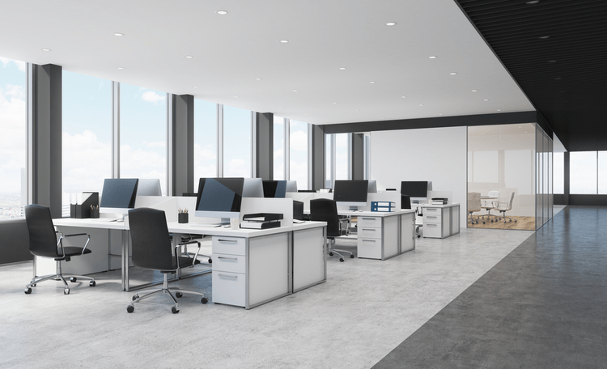

# Reservation_System

## Problem Statement
The company has several offices with computers (which can accommodate different numbers of people). Now a system needs to be developed so that employees can book places in advance to prevent overcrowding in the office.

## Requirements
1. Users:
- Employee: Request for the positions
- System manager: Create the account for the boss and employees
- Boss: Check the request from the employees
2. Offices
- Office 1: Up to 20 people
- Office 2: Up to 50 people
- Office 3: Up to 100 people
3. Reservation System:
- Log in page
  - Employee
  - System manager
  - Boss
  - Exit
- 
5. Request Rules:
- Employee can request for the whole week.
- System manager must clear the request every week.
- Boss should check the request from the employee wo decide whether to accept or reject.

